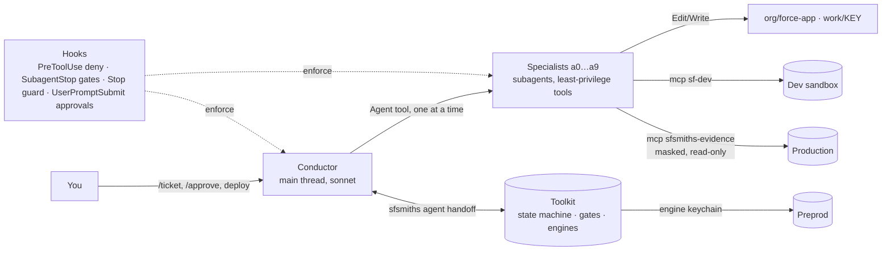

# SFsmiths

**AI craftsmen for your Salesforce org, running inside Claude Code. They forge, test and temper — you approve.**

SFsmiths turns one Claude Code session into a disciplined Salesforce team: an intake analyst, a reproduction
engineer, an architect, a developer, a QA engineer, a reviewer, a comms writer and a coach — each a Claude Code
subagent with a single job and least-privilege tools — coordinated by a conductor that follows a deterministic
toolkit instead of its own judgement. Every stage must pass mechanical **gates** before the next one starts; every
risky step waits for **you**.

```
/ticket PROJ-123
   → prior art → intake → baseline sync (preprod → dev) → org map → REPRODUCE (failing test)
   → plan (every API name verified) → develop (dev sandbox only) → QA → review + deploy brief → comms drafts
   → you deploy (Blue Canvas / your tool) → QA in preprod → you deploy to production → read-only verify → coach retro
```

## What makes it different from "an AI that writes Apex"

| | SFsmiths |
|---|---|
| **Production** | Read-only, always. One masked, logged evidence channel (`sfsmiths-evidence` MCP) through a least-privilege user. No agent has a production login, deploy path or write tool. |
| **Preprod** | Reachable only by the toolkit's *engine* keychain (a separate `HOME`), never by an agent. Baseline sync copies preprod → dev before work starts, so fixes are built against reality. |
| **Proof before fix** | Nothing is fixed until a test **fails** on the bug (and an inverse test passes). The referee is a run file, not prose. |
| **Zero hallucinated names** | Plans are linted against describe/metadata caches of *your* org: an API name that does not exist fails the stage. |
| **Zero real email** | Canary probe proves deliverability is off before data is created; every artifact is scanned for non-allowlisted addresses. Test data uses `*@example.com`-style domains only. |
| **Your style** | Comments match the existing codebase format; names describe behaviour, never ticket numbers. |
| **Humans decide** | Tier-based gates (LOW/MEDIUM/HIGH), per-agent ask/auto, typed approvals on HIGH plans, deploys always human. Approvals are recorded by a prompt hook only *you* can trigger. |
| **Learns from evidence** | A reward ledger computed from events (gate results, denials, escalations, your decisions) → lesson candidates → you approve → injected into the right agent as a skill. Agents' own notes are quarantined until confirmed. |
| **Nothing hard-coded** | Orgs, tracker, emails, names, models, budgets live in `config/*.yaml` (schema-validated; tracked defaults in `config/defaults/`, your copies gitignored). Clone, run `setup`, add your orgs — `git status` stays clean. |

## Quick start (macOS / Linux)

```bash
git clone <your-fork> sfsmiths && cd sfsmiths
npm ci && npm run build && npm test           # 75 offline tests: state machine, gates, hooks, lifecycle, UI, MCP, scripts, config layers, Run 1 fixes
npm run install:toolkit                       # installs ~/.sfsmiths/bin (hooks call this copy, never the repo)
export PATH="$HOME/.sfsmiths/bin:$PATH"

sfsmiths-human setup                          # wizard → config/orgs.yaml, tracker, emails, models
sfsmiths-human org login --alias DevSandbox --keychain agent      # dev sandbox (read-write)
sfsmiths-human org login --alias Production  --keychain agent     # as the READ-ONLY evidence user (docs/SETUP.md §3)
sfsmiths-human org login --alias PartialUAT  --keychain engine    # preprod, engine keychain only
sfsmiths-human sync && sfsmiths-human doctor  # generated files + boot conditions must be green

# in Claude Code, once:  /plugin marketplace add ./  →  /plugin install salesforce-development@sfsmiths-pinned
sfsmiths-human start                          # conductor session → /ticket PROJ-123
sfsmiths-human ui                             # local control room (127.0.0.1 + token): dashboard, agents/models, orgs, tickets, lessons, config
```

No Jira yet? Set `tracker.adapter: file` and drop `inbox/DEMO-101.md` (template in `templates/inbox-ticket.md`).

Full setup, including creating the production read-only user and the Phase 0 spikes: **[docs/SETUP.md](docs/SETUP.md)**.

## How it is built



- **Claude Code layer** — `.claude/agents/*.md` (12 agents), `.claude/skills/` (rules, methods, generated lessons), `.claude/rules/` (path-scoped), `.claude/commands/`, `.claude/settings.json` (hooks + permissions = enforcement), `CLAUDE.md` (arbitration).
- **Toolkit** (`src/`, TypeScript, zero-LLM) — `sfsmiths agent …` verbs agents may run; `sfsmiths-human …` verbs only you run; `sfsmiths-hook` (fast deny hooks, stage gates); two MCP servers (`sfsmiths-mcp-evidence`, `sfsmiths-mcp-ui`); the local UI.
- **Config** (`config/`) — 14 schema-validated YAML files: tracked defaults in `config/defaults/`, your personal copies beside them (gitignored). **Knowledge** — checklists, guards, lessons, docs mirror. **Templates** — stage prompts and file skeletons. **Schemas** — manifest, config, stage contracts.

Deep dive: [docs/ARCHITECTURE.md](docs/ARCHITECTURE.md) · daily operations: [docs/RUNBOOK.md](docs/RUNBOOK.md) · what could go wrong and why it can't: [docs/THREAT-MODEL.md](docs/THREAT-MODEL.md) · words: [docs/GLOSSARY.md](docs/GLOSSARY.md).

## Status

**v0.1.0 — complete design implementation, verified offline.** Build, 75 tests (state machine, 15 gates, hook denials,
full ticket lifecycle incl. rejection and support-agent flows, UI, MCP servers), hardcode-lint and hook latency pass in CI. What still needs *your* orgs is
listed in [docs/SETUP.md → Phase 0 spikes](docs/SETUP.md#phase-0-spikes) (≈3½ days): sf-skills plugin coexistence,
read-only-user Tooling rights, email canary result shape, baseline drift patterns, live hook behaviour. Run them before
the first real ticket; record findings in `docs/DECISIONS.md`.

## Principles (P1–P11)

Production read-only · preprod engine-only · humans deploy · least privilege · evidence or nothing · learn from events
only · untrusted text is data · gates decide · zero real email · meaningful names in the org's style · honest escalation.
The long form lives in `.claude/skills/sfsmiths-core-rules/SKILL.md` — every agent has it preloaded.

## License

MIT. The pinned third-party plugin (`forcedotcom/sf-skills`) keeps its own license; see `.claude-plugin/README.md`.
