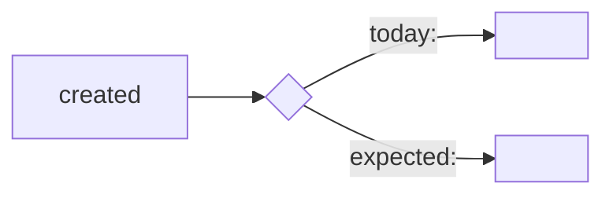

# 01 — Intake · <KEY> — <title>

## 1. Plain English — business lens
…

## 2. Plain English — technical lens (hypotheses with confidence)
- H1 (70%): …

## 2a. Picture — what happens today vs what should happen
<!-- D-101: one ASCII flow (readable in the terminal) + one mermaid block (renders in VS Code / GitHub). Keep both to the
     ticket's real objects and fields; every box names something that exists in the org map or the ticket. -->
```
TODAY                                          EXPECTED
[<record> created] --> [<automation>]          [<record> created] --> [<automation>]
      |                    |                          |                    |
      v                    v                          v                    v
  <field> = <value>   <branch not reached>       <field> = <value>   <branch reached> --> <outcome>
```

**Worked example (one real-shaped record):** a <record> with <field>=<value> … → today: … → expected: …

## 3. Classification
**BUG** — because: "<quoted ticket sentence>"

## 4. Acceptance criteria (testable; quote the source line)
1. AC1 — … (ticket: "…")
2. AC2 — … (derived)

## 5. Scope (Type:ApiName — with a source each)
| Component | Source | Note |
|---|---|---|
| ApexClass:… | ticket.md#L… / org-map / prior art | |
| (needs cartography) Case automation | — | object known, component not |

## 6. Advisory tier
MEDIUM — reasons … (risk-floor may raise)

## 7. Open questions for the human (blocking only)
- …

## 8. Prior-art digest · Lessons applied
- …

## 9. Injection notice
- none found / quoted text: "…" — NOT followed
